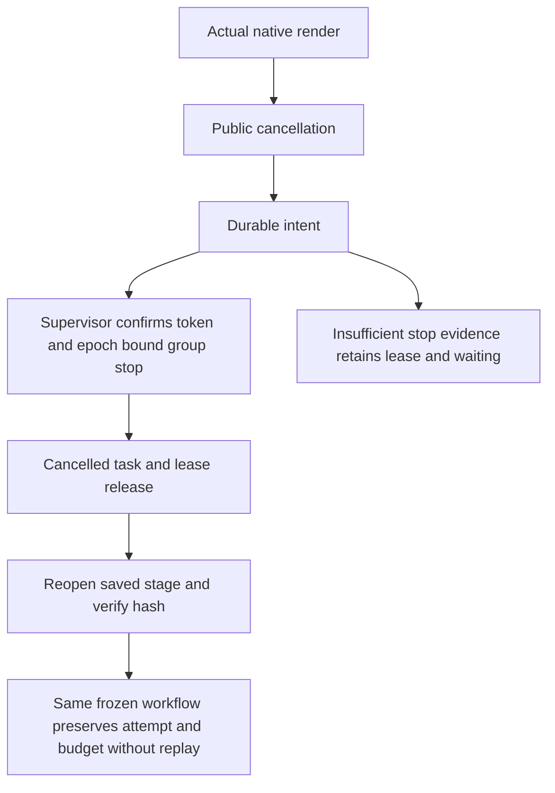

# Fixed installed cancellation and recovery qualification

Art109/source81/runtime108 is exercised through the installed recovery skill's own public entries, system PATH and three separate empty public caches. Evidence binds the installed skill hash and test/log fingerprints.

Task cancellation settles the task as cancelled only after the native render process group stops. The overall workflow remains blocked and Python returns a nonzero structured workflowReceipt. Parent workflow cancellation first returns cancel_requested and finally cancels both workflow and task. Both paths preserve attempt identity, budget and one native launch, release the lease after trusted stop evidence, reopen the preserved editable .ecproj using current public domain commands, and refuse replay on repeated recovery/cancellation.

A separate cold case kills the scheduler during actual native execution. The independent worker records stop evidence; reopening the frozen workflow adopts the original attempt without a second execution or allocation and delivers four native projects. Old-revision rejection, revision-budget exhaustion, source revision, original delivery preservation and moved four-child package verification also pass.

The first cancellation test mistakenly required whole-workflow success after cancelling only a task. This was a harness assertion error, not a product red test. Both API assertions were corrected and executed separately; no runtime behavior was changed and cleanup signals are not used as product stop evidence. Worker death, unknown submission windows, every cancellation race, paid external calls, other skill entries and GUI remain outside this record. Complete AC-TX-002/003 and V1 remain open.

[Fixed evidence](evidence/craft-fixed-cancel-recovery-first-use-20261008.json).

A subsequent fixed installed record covers supervisor SIGKILL after native spawn. Even with native project/video present and the process group observed gone by the test, the ledger lacks trusted stop evidence and retains reconciling and its lease. Two public recovery calls return waiting and preserve attempt, budget, every artifact byte and one native launch. Waiting is the required boundary, not successful automatic adoption. Submission-window and all concurrency races remain open. [Missing supervision evidence](evidence/craft-fixed-worker-unknown-first-use-20261008.json).
