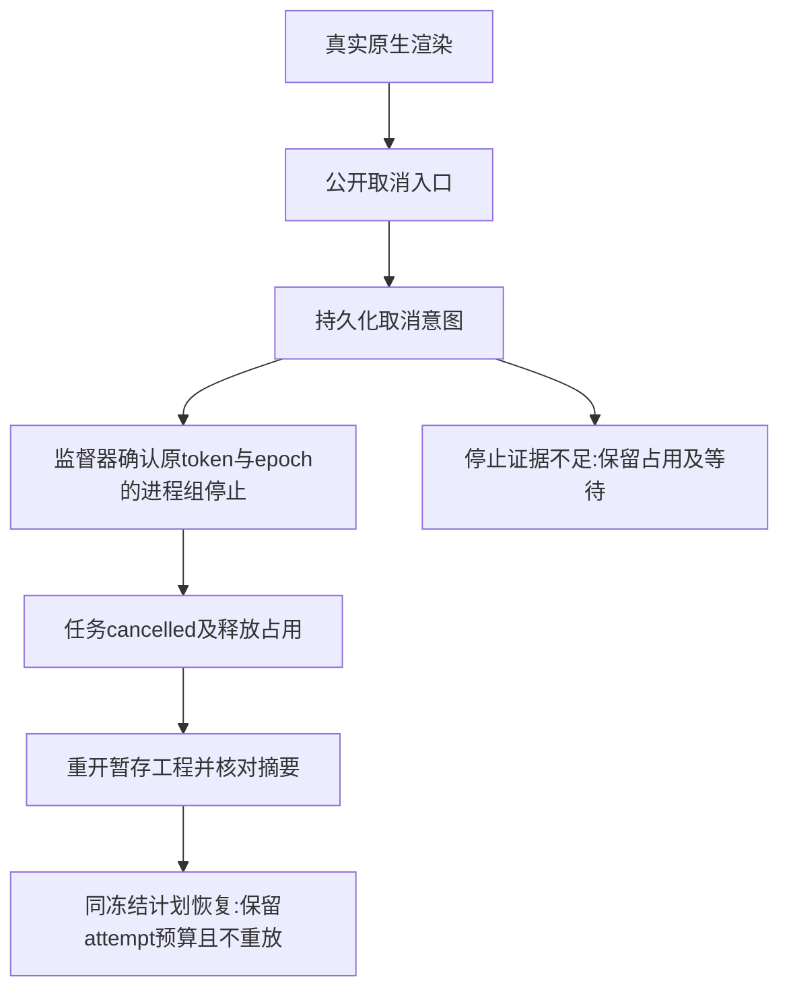

# 固定安装后的取消与接管验收

当前 Art109／独立技能源81／runtime108 的恢复技能按自身真实目录调用，在系统 PATH 与各自空缓存下完成公开下载。证据绑定安装技能摘要、测试源码与输出日志摘要。

取消单任务时，该任务先登记取消意图，监督器确认真实原生渲染进程组停止后返回 cancelled；整个工作流仍 blocked，Python 非零返回中的 workflowReceipt 保留任务回执。取消父工作流时返回 cancel_requested，最终工作流与任务均 cancelled。两条路径都保留原 attempt、预算和一次原生启动，停止后释放写占用；暂存 .ecproj 可通过当前领域公开命令重开，重复恢复及取消不重放原生任务、不修改工程。

另一个各自空缓存用例在真实原生任务运行中 SIGKILL 调度器：独立worker仍记录停止，重开相同计划接管原 attempt，四工程执行次数和预算不增加；旧修订冲突、预算耗尽、源工程返工、原交付保留及迁移四子工程包核验通过。

首次取消测试失败来自把单任务取消误认成整个工作流成功，未计为产品缺陷或产品红灯。校正两个API的断言后分别执行通过；没有改动运行时，也没有使用测试清理信号作为产品停止证据。worker崩溃、未知提交窗口、所有取消竞态、付费外部调用、其他技能及GUI仍未由本记录覆盖。完整AC-TX-002／003和V1保持开放。

[固定证据](evidence/craft-fixed-cancel-recovery-first-use-20261008.json)。
