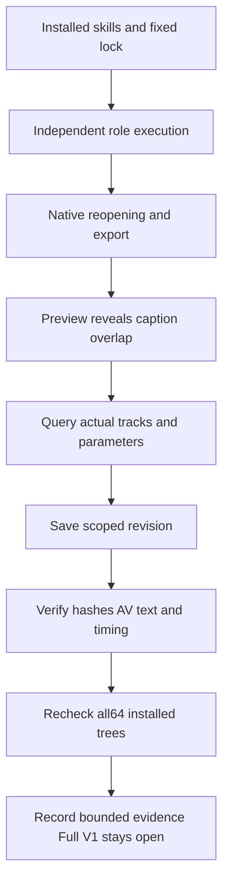

# Role checks against the current fixed installation

This run uses Film39/source36, Effect38/source34, Photo37/source33, Vector35/source31 and Art110/source82. Immutable skills and runtimes were unchanged; no new release was created. All17 tests passed. Metadata, source identity and complete tree hashes of all64 installed skills still match the fixed lock. Full V1 remains incomplete.

| Entry | Observed behavior | Scope |
| --- | --- | --- |
| Film10 domain roles | Project reopening, media import, cuts, gain, caption revision, embedded LUT, motion keys, supplied transcripts, multicam switching, video and exchange export | Actual installed single-role copies with separate fresh caches; transcript role uses supplied word timing |
| Film use | Native plans, reopening, images and Unicode/space paths | Small RGBA technical input |
| Film transcript | First public runtime/model download, actual English Whisper-tiny recognition, SRT, reopening and explicit workflow model directory | 28 words; reference-word set coverage1.0 is not WER or multilingual quality |
| Art plan/revise and role handoffs | Saved/moved Brief, native gate and contract rejection, four-domain source revisions, unrelated reuse, ledger query, five-child moved delivery, review query and idempotent cancellation | Three tests; no automatic requirement inference, full asset registration, worker-crash or creative acceptance claim |
| Art execute | Authorization scope isolation/reuse, stable budgets and preserved originals | Native Vector case; no provider login or paid generation |
| Art review | Independent review entry, relocation, stale-version/tamper rejection and preserved ledger/native bytes | Technical records include supplied test proof; creative acceptance NOT_RUN |

## Caption handoff after actual ASR

The native preview showed the template caption `First scene` below newly generated speech captions. Query `captions.list` for actual IDs, names, texts, enabled states and times. Disable only the explicitly superseded template track with `captions.setTrack.enabled=false`; preserve its text and timing. Do not automatically disable unrelated user captions. New tracks can change C1/C2 labels.

Read `commands.py describe captions.setTrack` and `describe captions.setStyle`, then save a separate revision. In this retained project only, the placeholder track was ID12 and the generated track ID14. ID12 was disabled; ID14 was set to Arial, size72 and margin0.04. Size is normalized to1080 lines, giving nominal12px at180 height. The rendered two-line result is readable. Adjust line length, font and actual output dimensions instead of applying72 everywhere.

Native reopening and hashes verify the source, audio/video, and all caption texts/times remain intact. The rendered overlap is gone. Editable projects, SRT, video and before/after previews are retained locally. This recipe has not yet been published in a new immutable skill release; maintenance documentation is not published skill content. Human creative acceptance remains NOT_RUN.

## Plugin count and remaining scope

Five plugins and independent skill sources exist locally. LightCraft, PrintCraft and DesignCraft have research sources but no corresponding plugin/skill repositories. Seven domain apps plus ArtCraft make eight. The ninth plugin in the latest attachment title is unidentified; a server repository name does not establish an additional product boundary. Whether ArtCraft Services is a separate plugin awaits user clarification. The existing ArtCraft specification treats it as an architecture reference. ArtCraft still excludes Jianying integration.

[Evidence digest](evidence/craft-installed-role-refresh-20261008.json). All command contexts, full V1, generic Skills CLI installation, worker-crash/unknown-submission recovery, GUI, other platforms and human creative acceptance remain open. No full requirement was closed; OpenSpec sync/archive was not run.
