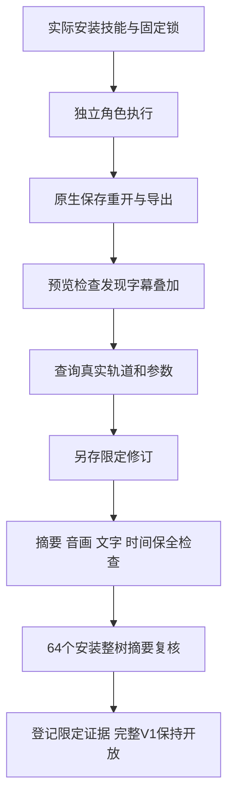

# 当前固定安装的角色复验

本轮使用既有固定矩阵 Film39/source36、Effect38/source34、Photo37/source33、Vector35/source31、Art110/source82。未修改不可变技能内容或运行时，也未新发版本。17 项测试通过，操作后 64 个宿主技能目录的元数据、来源与整树摘要继续匹配锁。此结论不等于完整 V1 完成。

| 入口 | 本轮已执行行为 | 证据边界 |
| --- | --- | --- |
| Film 10 个领域角色 | 项目保存重开、素材探测导入、裁切、音量、字幕修订、LUT 嵌入、运动关键帧、导入转录、多机位切换、视频及交换导出 | 使用各自独立的实际安装技能副本与空缓存；转录角色案例使用提供的词时间 |
| Film use | 原生计划、保存重开、图片渲染、含空格及 Unicode 路径 | 小型 RGBA 技术输入 |
| Film transcript | 首次公开运行时和固定 Whisper-tiny 模型下载、真实英文语音识别、SRT、保存重开、工作流显式模型目录 | 独立补充真实 ASR；28 个识别词、参考词集合覆盖 1.0，不是 WER 或跨语言质量证明 |
| Art plan/revise 与角色交接 | 规划保存移动、原生门禁及合同拒绝、四领域源返工、无关复用、素材账本查询、五子工程移动打包、审阅查询、取消幂等 | 3 个测试；不证明自动需求推断、完整素材登记、worker 崩溃恢复或人工创作接受 |
| Art execute | 不同授权范围任务隔离、相同范围任务复用、预算稳定、原工程保全 | Vector 原生案例，无真实供应商授权或付费生成 |
| Art review | 独立审阅入口、移动后验证、过期版本与篡改拒绝、账本和原生字节保全 | 技术检查记录包含测试提供的证明；创作接受 NOT_RUN |

## 自动转录的字幕交接

实际预览发现 `transcript.createCaptions` 新建轨道后，模板的 `First scene` 字幕仍显示。先通过 `captions.list` 检查所有轨道的真实 ID、名字、文字、启用状态和时间。只对任务明确替换的模板占位轨道设置 `captions.setTrack.enabled=false`；保留其文字和时间，无关用户字幕不自动关闭。新增轨道可能改变 C1/C2 标签，不能依赖旧标签。

读取 `commands.py describe captions.setTrack` 和 `describe captions.setStyle` 后构造另存修订。此保留案例查询得到原模板轨道 ID12、生成轨道 ID14；这些 ID 仅适用于该工程。修订关闭 ID12，将 ID14 设为 Arial、size72、margin0.04。size 按 1080 行归一，180 高画面对应名义12px。两行字幕在实际预览可读；必须结合行长、字体和目标尺寸调整，不能固定套用72。

修订交付的原生重开和摘要核对证明：原工程不变，音视频轨道不变，两条字幕轨道的文字与时间不变；渲染已消除叠加。工程、字幕、成片和前后预览保留在本地任务产物。此方法尚未更新到新不可变技能发行，不把维护文档当作已发布技能内容。人工创作验收仍未执行。

## 插件数量与剩余范围

本地已存在五套插件和独立技能源。LightCraft、PrintCraft、DesignCraft 只有研究源码，尚无对应插件和技能仓库。七领域加 ArtCraft 为八个；最新附件标题的第九个未列明，不能根据服务端仓库名自行新增产品边界。ArtCraft Services 的独立插件身份待用户确认；现有 ArtCraft 规格仅将其列为架构参考。ArtCraft 继续不适配剪映。

[本轮摘要证据](evidence/craft-installed-role-refresh-20261008.json)。完整命令上下文、全 V1、通用 Skills CLI 安装、worker 故障及未知提交恢复、GUI、其他平台、人工创作验收仍开放。本轮未关闭完整要求，未执行 OpenSpec sync/archive。
