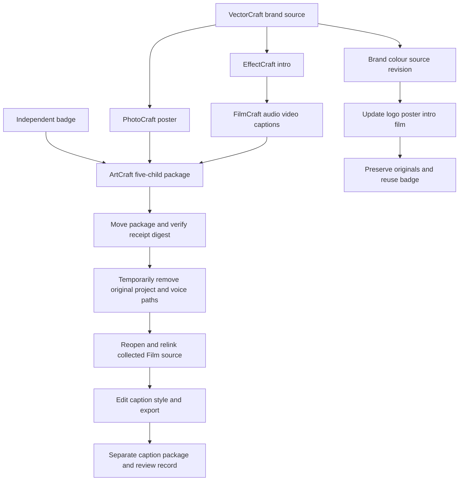

# Retained native mixed delivery and caption revision

An actual installed ArtCraft dev.109 / independent source dev.81 / runtime dev.108 `artcraft-use` skill was copied alone and executed using system PATH and public installation. Two five-child brand versions, a caption-only revision from a moved native source, and three moved packages are retained. Independent creation receipts supply package digests; the inventory binds native files and collected media. Media stays under workspace artifacts/craft-retained-delivery-20261008 rather than in this repository.

This is a 320×180, 12fps, two-second technical example. VectorCraft retains three editable artboards and their SVG/PNG/PDF exports; PhotoCraft retains `.pcraft`, PSD and poster; EffectCraft retains `.ecproj`, intro and preview; FilmCraft retains `.fcproj`, real speech, captions, media references, preview and final video. ArtCraft retains five child references, plans and workflow records. Existing macOS say / Fred generated 1.2203125 seconds of speech without a voice installation or paid provider.

Brand revision changes four dependent tasks and reuses the independent badge. Repeating the frozen revision preserves task IDs and budget. Original deliveries and unrelated third-artboard SVG/PNG/PDF bytes remain unchanged. With old project and voice paths temporarily unavailable, public sourceProject execution reopens and relinks the moved Film native project. Video/audio tracks, caption IDs/text/timing, the upper 135 preview rows and original package bytes remain unchanged. Parked originals were restored. This proves the tested CLI path; GUI automatic relinking remains untested.

The first demo plan incorrectly placed 1.22-second speech for two seconds; native `clip_out_of_range` rejected it. That failed plan/project is retained. A corrected plan uses the registered source length and reuses the cache downloaded on the first attempt, so the corrected run is not a second cold installation. The runtime source-bound check was not changed.

Inspection of real previews found size18 too small at height180. Current upstream caption rendering normalizes size to 1080 lines: `nominalPixels = size × frameHeight / 1080`. Size84 yields nominal14px here, increasing measured bright glyph height from three to ten rows. Plan captions for output dimensions and keep audio within actual source bounds. These are recorded configuration findings; published standalone skills and native runtime were not modified.

Two digest-bound review records were recorded and verified. The brand V2 caption observation requests changes. The corrected single-child package has technical and named model visual observations PASS, human acceptance NOT_RUN and decision pending. Other five-child assets lack complete creative reviews. Review records do not modify ledger state.

[Fixed evidence and native inventory](evidence/craft-retained-mixed-delivery-20261008.json). Full V1, every-command execution, real generic Skills CLI installation, other platforms, GUI and human acceptance remain open. No complete requirement was closed or archived.
