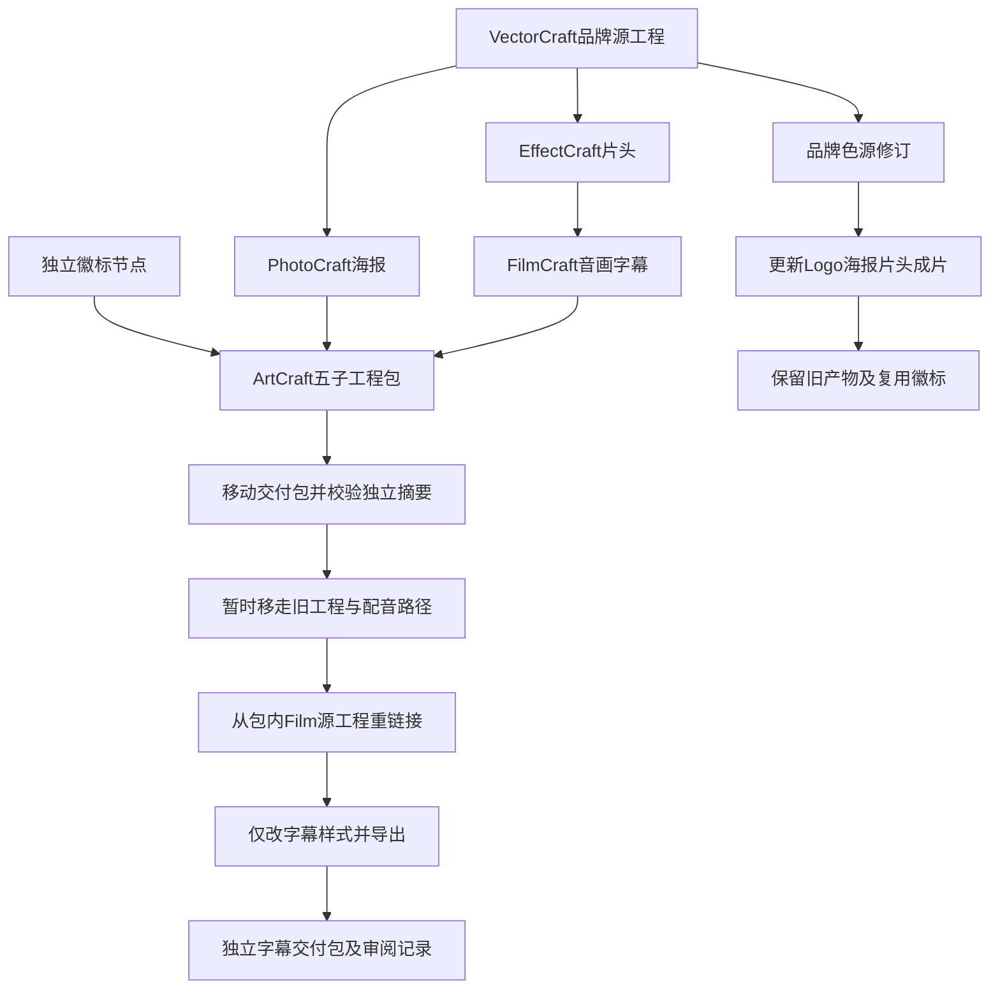

# 保留的原生混合交付与字幕返工

固定 ArtCraft 插件 dev.109、独立技能源 dev.81、运行时 dev.108 的实际安装 `artcraft-use` 单独复制后，以系统 PATH 执行公开安装与原生创作。已保留两个五子工程品牌版本、一次移动源工程字幕返工及三个迁移后验包成功的交付包。每包摘要来自独立创建回执，文件清单绑定全部原生工程与素材摘要；媒体保留在工作区 artifacts/craft-retained-delivery-20261008，不提交进插件仓库。

这是一套 320×180、12fps、2秒的技术示例。VectorCraft 保留三画板 `.vectorcraft` 和各自 SVG／PNG／PDF；PhotoCraft 保留图层工程 `.pcraft`、PSD和海报；EffectCraft 保留 `.ecproj`、片头及预览；FilmCraft 保留 `.fcproj`、实际语音、字幕、引用素材、预览与成片。ArtCraft 包含五子工程引用、计划和工作流记录。实际语音使用本机已有 macOS say 的 Fred，1.2203125秒，没有安装语音服务或调用付费提供方。

品牌源修订改变四个受影响节点，独立徽标复用，重复同修订保留任务ID与预算；旧交付和无关第三画板的SVG／PNG／PDF字节不变。随后原始工程目录与原配音文件临时移走，从移动包内 Film 原生工程按公开 sourceProject 路径重开、重链接，修改字幕字号后导出。音视频轨、字幕ID／文字／时间及上部135行预览像素完全不变；原包内容不变。临时移走的原文件均已恢复。这个结果证明所测CLI路径，不证明GUI自动重链接。

首次示例计划错误地将实际1.22秒语音放置为2秒，原生 `clip_out_of_range` 拒绝；原失败计划及工程保留，改正计划采用已登记源的实际长度。纠正方案复用首次公开下载的缓存，不能称为第二次冷安装。该失败属于示例计划错误，没有改变运行时边界检查。

实际查看预览发现默认18字号在180高画面太小。当前上游字幕实现按1080行归一，`nominalPixels = size × frameHeight / 1080`；本例size84对应14px，亮字高度由3行增至10行。使用实际尺寸规划字幕，音频裁切不得超过源长度。这些是本次记录的配置结论；未修改已发布独立技能或原生运行时。

两个当前摘要绑定的审阅记录也已记录并复核：品牌V2字幕可读性观察返回 `changes_requested`；修正版单节点包技术和具名模型视觉观察PASS，人工验收NOT_RUN，结论 `pending`。五子工程包的其他产物没有完整创作审阅，因此不能把局部观察提升为整体创作通过。审阅记录不修改任务账本状态。

[固定证据与产物清单](evidence/craft-retained-mixed-delivery-20261008.json)。完整V1、全量命令运行、真实通用Skills CLI安装、其他平台、GUI和人工作品验收仍开放。没有修改或归档完整需求。
