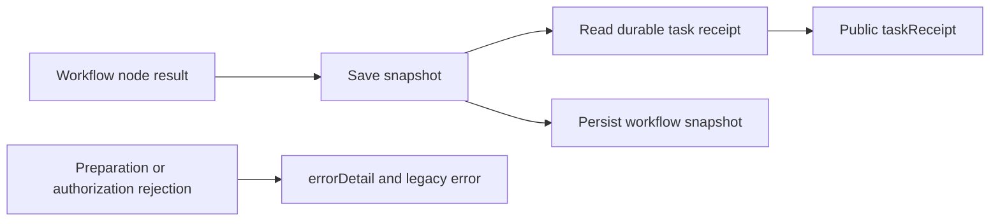

# Workflow task receipt visibility

The workflow response now includes a `taskReceipt` for each registered node, read from its durable ledger whenever the node is saved. It contains taskId, attemptId, state, runtimeIdentity, outputRefs, evidenceRefs and error. The workflow node status remains a compatible scheduling summary. A planned/ready receipt with a null attempt means registration or preparation, not native execution. Reuse keeps the original task and attempt identities.

A preparation, registration or authorization rejection adds `errorDetail` with code and message while preserving the legacy error string. Registration rejection has no fabricated receipt. Preflight and CLI rejections use the same error formatter. Native durable failure remains in the receipt error; a transient rejection does not rewrite ledger state. No extra tool invocation, budget allocation or native replay is introduced by response enrichment.

This is a source candidate governed by AC-CP-001-WORKFLOW-RECEIPT. Local fixture processes validate response semantics, reuse and rejection boundaries; they do not establish real creative application or published first-use acceptance. Runtime bundle publication, independently installed Art skills and full AC-CP-001 acceptance remain pending. Existing fixed releases retain their previous behavior.
