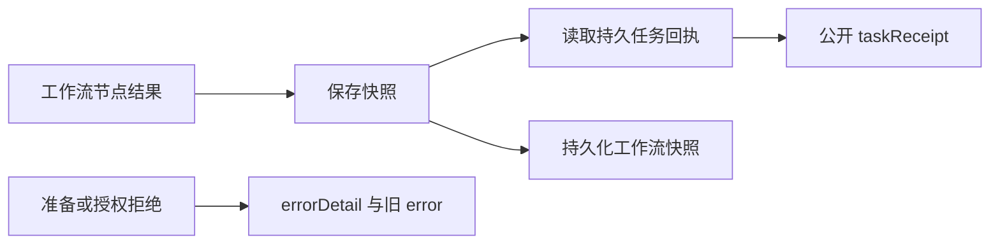

# 工作流任务回执可见性

工作流保存每个已登记节点时，从持久账本读取并公开 `taskReceipt`，包含 taskId、attemptId、state、runtimeIdentity、outputRefs、evidenceRefs 与 error。节点 status 保持兼容的调度摘要。planned／ready 且 attemptId 为 null 表示登记或准备，不能当成原生执行。复用保留原任务与尝试身份。

准备、登记或授权拒绝新增包含 code／message 的 `errorDetail`，保留原字符串 error。登记拒绝不伪造回执；预检查与 CLI 拒绝使用同一格式器。持久原生失败在回执 error 中表达，瞬时拒绝不改写账本状态。这项响应补充不会新增工具调用、预算分配或原生重放。

当前是 AC-CP-001-WORKFLOW-RECEIPT 管理的源码候选。本地夹具进程验证响应、复用及拒绝边界，不能证明真实创作应用或已发布首次使用验收。运行时包发布、独立安装 Art 技能及完整 AC-CP-001 验收仍待完成；已有固定发行保持旧行为。
