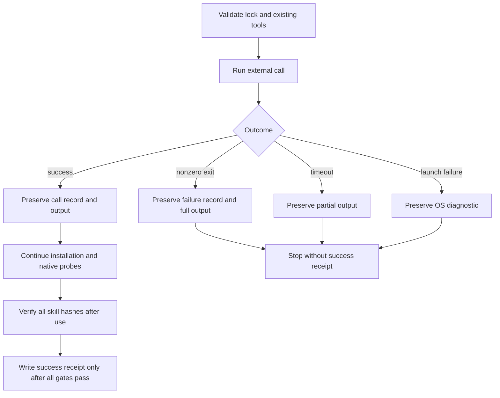

# Independent skill installation diagnostics architecture

## 1. Scope and authority

OpenSpec `AC-SK-002-INSTALL-DIAGNOSTIC` defines diagnostics for the existing five-package Skills CLI acceptance gate. This changes the verifier, not the published 64 skills, their native runtimes or their locked identities. Actual public installation remains a separate, open gate (task 3.16).

## 2. Execution and evidence

`scripts/verify_independent_skill_install.py` validates the fixed source lock and existing tools before creating a new, private output directory. Every external call receives a sequential record in `calls/0001.json`, with separate `0001.stdout.log` and `0001.stderr.log` files. Records include argv, cwd, the native-call flag, the 600-second timeout, status and return code. Environment variables are not serialized. CLI arguments in this verifier contain public fixed sources and local tool paths; output may contain tool diagnostics, so retain the QA directory privately.

Timeout output can be bytes even when subprocess text mode is requested; diagnostics decode it as UTF-8 with replacement for invalid bytes. Earlier successful calls remain available after failure. Successful receipts retain their existing schema. The verifier does not automatically replay an interrupted installation or overwrite an existing output directory. If evidence writes fail, verification fails rather than claiming success.

## 3. Verification and limits

`tests/test_independent_skill_install.py` covers nonzero exit, timeout with partial bytes, and OS launch errors, asserting that no success receipt is produced. A real Python child process also exits with code 7 and writes separate stdout/stderr; the test verifies the retained files. These tests establish diagnostic behavior, not a successful real Skills CLI installation, a 64-skill cold start or creative delivery. Existing source-lock, independent-tree and native-version guards remain required.

[Bound evidence](evidence/independent-install-diagnostics-20261008.json): 15 targeted tests pass; the complete Python suite runs 109 tests, with 103 passing and six conditional skips. A retained real-child comparison reproduces zero call records on the unchanged baseline and two call records after the fix; neither failure writes a success receipt. No public Skills CLI was executed by that fixture.
