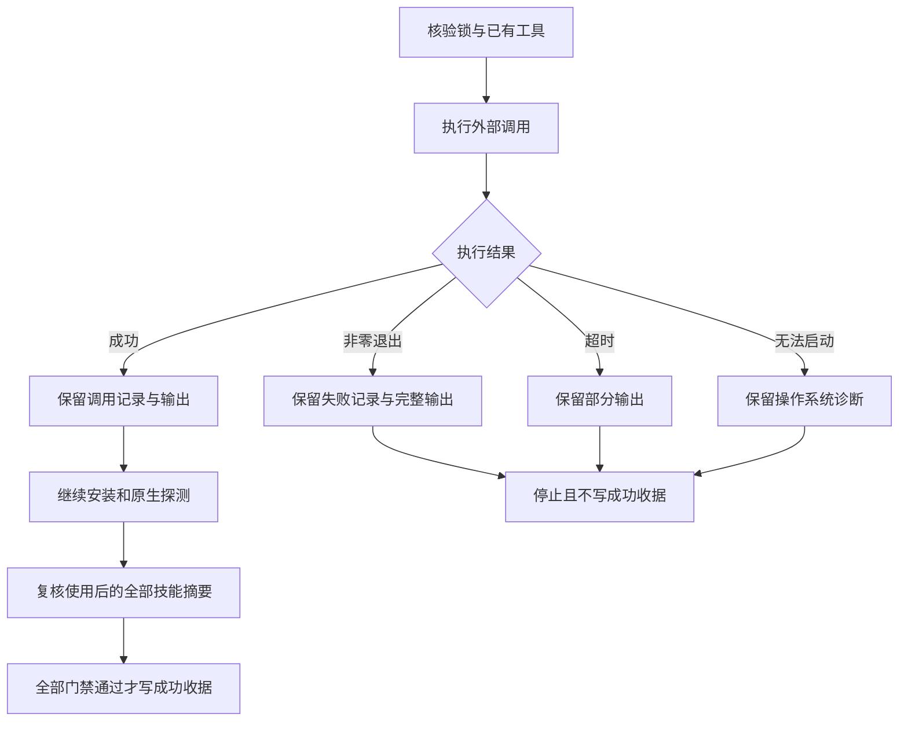

# 独立技能安装诊断架构

## 1. 范围与规范

OpenSpec `AC-SK-002-INSTALL-DIAGNOSTIC` 定义已有五套技能 Skills CLI 安装验收的诊断行为。本次修改验收器，不改变已发布的 64 个技能、原生运行时及固定身份。实际公开安装仍是独立的开放门禁（任务 3.16）。

## 2. 执行与证据

`scripts/verify_independent_skill_install.py` 先核验固定来源锁和已有工具，再创建私有的新输出目录。每次外部调用按顺序写入 `calls/0001.json`，stdout／stderr 分别保存为 `0001.stdout.log`、`0001.stderr.log`。记录包含 argv、cwd、原生调用标志、600 秒超时配置、状态与退出码，不序列化环境变量。本验收器的参数包含固定公开来源和本地工具路径；输出可能含工具诊断，应私有保留 QA 目录。

即使请求 subprocess 文本模式，超时输出仍可能是 bytes；诊断按 UTF-8 解码，对无效字节使用替换字符。失败后保留此前成功调用的记录。成功收据保持原 schema。验收器不自动重放中断的安装，也不覆盖已有输出目录；证据写入失败时验收失败，不宣称成功。

## 3. 验证与限制

`tests/test_independent_skill_install.py` 覆盖非零退出、携带部分 bytes 的超时及操作系统启动错误，并断言不产生成功收据。另有一个实际 Python 子进程以退出码 7 结束，分别输出 stdout／stderr，测试核验保留文件。这些测试证明诊断行为，不证明真实 Skills CLI 安装成功、64 项独立冷启动或创作交付。原有来源锁、独立副本及原生版本门禁仍须满足。

[绑定证据](evidence/independent-install-diagnostics-20261008.json)：15 项目标测试通过；Python 完整回归共 109 项，103 项通过、6 项条件跳过。保留的真实子进程对照复现未改基线无调用记录，修复后保留两次调用记录；两次失败均不产生成功收据。该 fixture 没有执行公开 Skills CLI。
