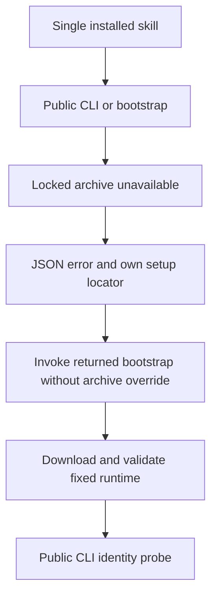

# Single-skill dependency failure and recovery

The current fixed five-plugin installation contains 64 skills: FilmCraft 13, EffectCraft 15, PhotoCraft 13, VectorCraft 13 and ArtCraft 10. Every skill was copied alone into an isolated `.agents/skills/<name>` directory with spaces in its parent path. The installed source identity was checked against `host-acceptance-art105.lock.json` before and after execution.

128 real public calls (each skill's `bootstrap.py` and `cli.py`) used an explicit absent archive and an empty runtime directory. Every call failed with structured JSON, the correct setup skill name and the current skill's own absolute bootstrap path. No automatic retry, executable runtime, leftover installation staging directory, skill content change or user-file change was observed. This test injects an unavailable archive; it does not simulate an unavailable network.



For each domain, the same failed `use` copy and runtime directory were then recovered through the returned bootstrap locator with default online download. All five public CLI identities matched the locked names and complete versions. ArtCraft used `--runtime-only`, installing its Node and orchestration runtime; domain dependencies are installed later according to the workflow. These are five recovery installations, not 64 new successful online installations.

Users locate `SKILL_DIR` from the actual loaded `SKILL.md`, then run:

```bash
: "${SKILL_DIR:?Set the absolute directory of the loaded SKILL.md}"
python3 -I -B "$SKILL_DIR/scripts/cli.py" -- --version
```

On setup failure, the JSON `dependencySetup.bootstrapScript` points to the bootstrap inside that same skill. Preserve the reported `runtimeHome` when retrying; remove an invalid archive override only when a default online download is intended. A setup skill's name is a routing hint, not a requirement to read a sibling directory.

[Version-bound evidence](evidence/craft-single-skill-dependency-recovery-20261008.json) records all 64 identities, 128 failures and five recoveries. The complete local receipt retains process outputs; the published evidence excludes temporary absolute paths and installation caches.

The SK-002 negative scenario literally requests diagnostics when a runtime is absent, while SK-003 requires automatic first-use installation. This run covers failed installation and recovery and leaves the complete SK-002 contract and its tasks open. Single-directory isolation demonstrates operation without sibling files; no filesystem tracing was used to establish every attempted file access. Generic Skills CLI installation, creative scene acceptance, other platforms and production are outside this evidence.

## Independent installation copy validation

The Skills CLI installation verifier previously filtered the installed tree with `is_file()` before checking symbolic links. Directory and dangling links disappeared from its digest inventory, and a linked skill root or direct parent could pass. It now validates the root, direct parent and every tree entry before hashing ordinary files. Linked trees, special entries and missing directories fail before native version probes; ordinary file digests remain compatible.

Five tests reproduced ten failures on the previous implementation. The corrected target suite passes 16 tests; the full Python suite passes 92 of 97, with five conditional tests skipped. Four mocked external-installer cases verify no native probe or success receipt is produced. The corrected verifier also matches all 64 current fixed installed skill tree digests. [Evidence](evidence/independent-copy-preflight-20261008.json) binds the current code and tests. This does not exercise the real generic Skills CLI or defend against every concurrent filesystem race and arbitrary linked ancestor.
