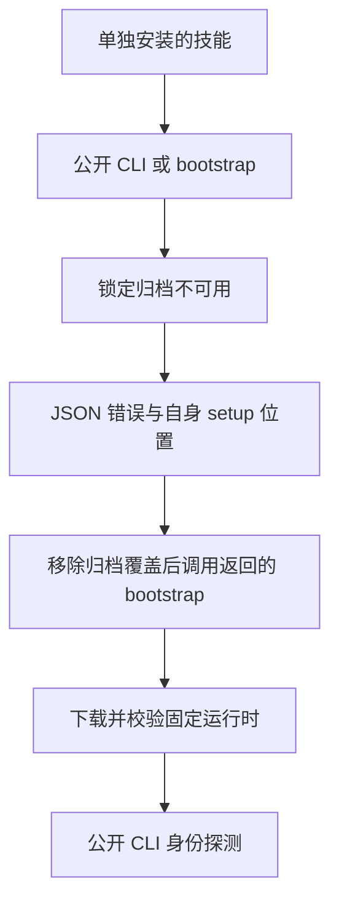

# 单技能依赖安装失败与恢复

当前固定五插件安装包含 64 个技能：FilmCraft 13、EffectCraft 15、PhotoCraft 13、VectorCraft 13、ArtCraft 10。每项技能均单独复制到隔离的 `.agents/skills/<name>`，父路径包含空格；执行前后依据 `host-acceptance-art105.lock.json` 核对实际安装来源身份。

每个技能的 `bootstrap.py` 与 `cli.py` 分别使用空运行时目录及明确不存在的归档，共执行 128 次真实公开调用。全部返回非零退出码、结构化 JSON、正确的 setup 技能名称和当前技能自身的绝对 bootstrap 路径。未观察到自动重试、可执行运行时、残留安装暂存目录、技能字节变化或用户文件变化。此处注入的是不可用归档，没有模拟网络故障。



每个领域选择同一个失败的 `use` 技能副本及运行时目录，通过返回的 bootstrap 位置执行默认在线下载恢复。五个 CLI 名称和完整版本均匹配锁。ArtCraft 使用 `--runtime-only` 安装 Node 与编排运行时，领域依赖随后按工作流安装。这是五次恢复安装，不是 64 次新的在线成功安装。

用户从宿主实际加载的 `SKILL.md` 定位 `SKILL_DIR`，运行：

```bash
: "${SKILL_DIR:?请设置为实际加载的 SKILL.md 所在绝对目录}"
python3 -I -B "$SKILL_DIR/scripts/cli.py" -- --version
```

安装失败时，JSON 的 `dependencySetup.bootstrapScript` 指向本技能内的安装器。重试应保留报告的 `runtimeHome`；只有确实准备使用默认在线下载时才移除无效归档覆盖。setup 技能名称用于路由提示，不要求读取兄弟技能目录。

[版本绑定证据](evidence/craft-single-skill-dependency-recovery-20261008.json)记录全部 64 项身份、128 次失败和五次恢复。完整本地回执保留进程输出；公开证据排除临时绝对路径和安装缓存。

SK-002 负向场景字面要求运行时缺失时返回诊断，SK-003 则要求首次使用自动安装。本轮仅覆盖安装失败及恢复，完整 SK-002 合同与任务仍开放。单目录隔离证明无兄弟文件时可以工作，没有使用文件系统追踪证明每一次尝试访问。通用 Skills CLI 安装、创作场景验收、其他平台和生产不在本证据范围内。
