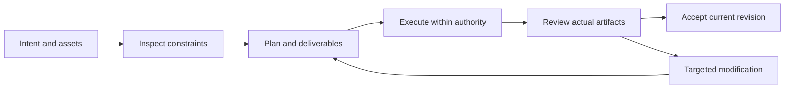

# ArtCraft V1 — 功能与界面规划

> **文档说明**：V1 实施阅读视图；规范事实源为 OpenSpec。
>
> **版本**：1.0.0
> **最后更新**：2026-10-05
> **状态**：目标设计；尚未实现。事实依据与验收结果单独标注。

关联文档：[品牌边界](../1%E3%80%81ArtCraft-%E5%91%BD%E5%90%8D%E4%B8%8E%E5%93%81%E7%89%8C%E8%AF%B4%E6%98%8E.md) · [技术方案](../5%E3%80%81ArtCraft-%E6%8A%80%E6%9C%AF%E6%96%B9%E6%A1%88%E4%B8%8E%E8%B7%AF%E7%BA%BF.md) · [详细架构](../../../docs/ArtCraft-Runtime-Architecture.zh_CN.md) · [OpenSpec](../../../openspec/changes/establish-v1-plugin/proposal.md) · [证据](../../../docs/evidence/runtime-baseline.json)

## 1. V1 功能模块

| 能力 | 行为边界 | 状态 |
| :--- | :--- | :--- |
| 混合需求与交付约束 | 将用户需求转为可版本化 Brief，记录画幅、品牌、角色、字体、预算与原生交付要求；歧义阻止依赖它的步骤，不阻塞独立检查。 | 计划中 |
| 能力与交付驱动路由 | 按能力快照与用户原生格式选工具；指定剪映工程不得静默替换为 FilmCraft 或 FFmpeg；不要求每次安装或调用全部插件。 | 计划中 |
| 依赖调度与并发隔离 | 执行前检查 DAG 循环、缺失节点与输入版本；独立节点可并行，同一原生工程单写；下游只消费已验证产物。 | 计划中 |
| 素材版本与选择性失效 | 区分逻辑资产 ID 与内容哈希；显式记录派生边；修改 Logo 只使传递依赖失效，已审阅旧版本仍可追溯。 | 计划中 |
| 跨产物一致性 | 以固定品牌与主体参考评估海报、片头和成片，问题绑定资产版本及帧或区域；单一提示词不是一致性证据。 | 计划中 |
| 交付与外部生态接入 | 汇总子工程、素材、输出、损失报告和验收记录；现有插件需经过公开适配接口，禁止导入兄弟仓库私有模块或伪造完成。 | 计划中 |

## 2. 宿主流程

## 3. 界面载体与责任

宿主展示计划卡、任务状态、预览与交付链接；原生编辑器承担精细人工编辑。诊断 JSON 供维护者读取，用户默认看到问题含义、影响范围与可执行恢复动作。

## 4. 异常状态

无素材显示缺失清单；无能力显示不支持项；执行中显示真实进度或未知进度；取消待确认保留占用；验收失败展示失败门禁与证据；不显示伪造百分比。

---

**文档版本**：1.0.0
**创建日期**：2026-10-05
**最后更新**：2026-10-05
**文档状态**：待评审；实现以 OpenSpec 任务和证据为准。
