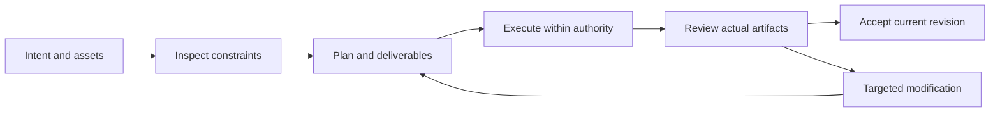

# ArtCraft V1 — Interaction-Plan

> **Purpose**: V1 implementation reading view; OpenSpec is normative.
>
> **Version**: 1.0.0
> **Updated**: 2026-10-05
> **Status**: Target design, not implemented. Observations and acceptance evidence are identified separately.

Related documents: [Brand boundary](../1%E3%80%81ArtCraft-Naming-and-Brand.md) · [Technical plan](../5%E3%80%81ArtCraft-Technical-Plan.md) · [Detailed architecture](../../../../docs/ArtCraft-Runtime-Architecture.md) · [OpenSpec](../../../../openspec/changes/establish-v1-plugin/proposal.md) · [Evidence](../../../../docs/evidence/runtime-baseline.json)

## 1. V1 functional modules

| Capability | Behavioral boundary | Status |
| :--- | :--- | :--- |
| Mixed brief and deliverable constraints | Create a versioned brief covering aspect ratios, brand, identities, fonts, budget and native deliverables; unresolved constraints block dependent steps but not independent inspections. | Planned |
| Capability and deliverable driven routing | Route using capability snapshots and requested native formats; never silently replace a requested Jianying project with FilmCraft or FFmpeg; do not require every plugin for every task. | Planned |
| Dependency scheduling and concurrency isolation | Validate DAG cycles, missing nodes and input revisions; independent nodes may run concurrently, native projects have one writer, and downstream nodes consume only verified artifacts. | Planned |
| Asset versions and selective invalidation | Separate logical asset IDs from content hashes; record derivation edges and invalidate only transitive dependents of a logo change while retaining historical reviewed versions. | Planned |
| Cross-artifact consistency | Evaluate posters, intros and films against fixed brand and identity references; bind findings to versions and frames or regions; a shared prompt is not consistency evidence. | Planned |
| Delivery and external ecosystem adapters | Collect child projects, assets, outputs, loss reports and acceptance records; integrate existing plugins through public adapters without importing private sibling modules or fabricating completion. | Planned |

## 2. Host journey

## 3. Surfaces and responsibilities

The host presents plans, task states, previews and delivery links; native editors support detailed manual editing. Diagnostic JSON is for maintainers; users see the issue, affected scope and actionable recovery.

## 4. Exceptional states

Missing assets show a checklist; missing capabilities show unsupported operations; running tasks show real or explicitly unknown progress; pending cancellation retains occupancy; failed acceptance shows gates and evidence. Do not fabricate progress percentages.

---

**Document version**: 1.0.0
**Created**: 2026-10-05
**Updated**: 2026-10-05
**Document status**: Ready for review; implementation status is governed by OpenSpec tasks and evidence.
